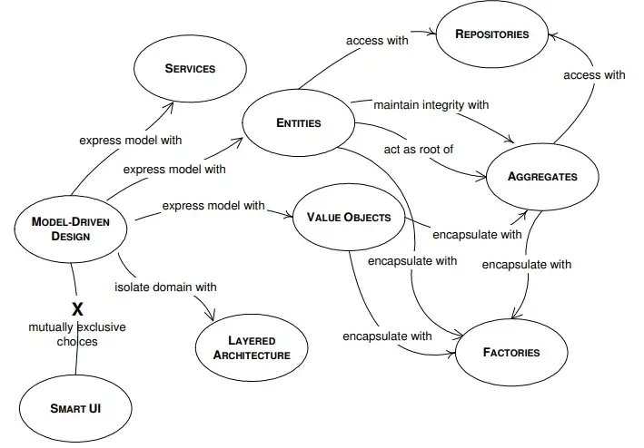

## Intro
Domain Driven Design (desde ahora DDD) es un enfoque de desarrollo de software utilizado por Eric Evans en su libro _“ Domain-Driven Design — Tackling Complexity in the Heart of Software, 2004”._  
Representa distintas claves, terminología y patrones utilizados para desarrollar software donde el dominio es lo más central e importante de una determinada organización.

Sus principios se basan en:

-   Colocar los _modelos_ y _reglas de negocio_ de la organización, en el core de la aplicación
-   Basar nuestro dominio complejo, en un modelo de software.
-   Se utiliza para tener una mejor perspectiva a nivel de colaboración entre _expertos del dominio_ y los _desarrolladores_, para concebir un software con los objetivos _bien claros._

## Beneficios

-   Comunicación efectiva entre expertos del dominio y expertos técnicos a través de ==Ubiquitous Languge==
-   Foco en el desarrollo de un área dividida del dominio (subdominio) a través de _Bounded Context’s_.
-   El software es más cercano al dominio, y por lo tanto es más cercano al cliente.
-   Código bien organizado, permitiendo el testing de las distintas partes del dominio de manera aisladas.
-   Lógica de negocio reside en un solo lugar, y dividida por contextos.
-   Mantenibilidad _a largo plazo_.

## Inconvenientes

-   Aislar la lógica de negocio con un experto de dominio y el equipo de desarrollo suele llevar mucho esfuerzo a nivel tiempo.
-   Necesitamos un experto de dominio —[¿ DDD sin Domain-Experts?](http://blog.koalite.com/2011/11/%C2%BFse-puede-hacer-ddd-sin-un-experto-en-el-dominio/)
-   Una curva de aprendizaje alta, con patrones, procedimientos,…
-   Este enfoque solo es sugerido para aplicaciones donde el dominio sea complejo, no es recomendado para simples CRUD’s.

Aunque seguramente aplicar DDD en un estado puro puede llegar a ser complejo, seguramente se pueden adaptar estos conceptos para utilizar los necesarios o los mas interesantes a la hora de decidir nuestra arquitectura. Hay varios enfoques de aplicación de estos conceptos: Onion Architecture, Hexagonal Architecture, Clean Architecture…

## Dominio

Es el problema específico que estamos intentando resolver del mundo real. Nosotros tenemos que abstraernos de este dominio, generando una abstracción a través de un _modelo_. Representa todo el conocimiento de un experto; pero este conocimiento es difícil de plasmar en un desarrollo de software. Un dominio “real” tiene demasiada información que plasmar y es tarea en conjunto la decisión de las abstracciones a lograr. _El primer y principal requerimiento de un modelo de dominio es ser consistente y sin contradicciones._

-   **Dominio principal o Core Domain**, El diferenciador clave para el negocio del cliente: algo que deben hacer bien y no pueden subcontratar.
-   **Subdominio**: separan las características o aplicaciones que su software debe admitir o debe interactuar. Es la segregación de un dominio más general en uno más acotado, cohesivo y comprensible.

El dominio se va a convertir en una capa en nuestra arquitectura, es un lugar central donde nada externo tiene que influir, complicar o distraer la idea principal: _el dominio como el corazón de nuestro software._  
La capa de dominio es la responsable de representar la información del negocio, la lógica del negocio, situaciones del negocio, a pesar de las dificultades que pueden conllevar la infraestructura. Es decir, nos abstraemos de nuestro detalles, que pueden ser que base de datos vamos a utilizar, como vamos a persistir, que framework frontend vamos a utilizar.

## Ubiquitous Language

La comunicación efectiva entre los desarrolladores y los expertos del dominio es esencial para el proyecto. Un lenguaje común, que sea representado en el dominio, tanto como en los _bounded contexts ( luego vemos que significa esto)_ es muy importante, para evitar tener problemas futuros y desarrollar un software exitoso, donde la comunicación sea el pilar para su obtención.

Una incompatibilidad en el lenguaje puede generar traducciones que no son necesarias, e incluso el problema de la traducción _ida-vuelta_: se traduce algo desde un idioma a otro, y luego cuando se intenta traducir en reversa, tiene otro significado.

# Elementos del dominio



## Entities

Las entidades son objetos que tienen identidad, normalmente un GUID, UUID o ID. Esto significa que aunque dos objetos de la misma clase, tengan los mismo valores de atributos, no son iguales, sino que la _identidad*_ es quien los identifica como el mismo objeto. Las entidades son capaces de ser buscadas, almacenadas y recuperadas. (track, look it, retrieve and store)

Pero… ¿cómo identificamos una entidad? Hay que tener en cuenta que según el contexto, una entidad represente algo particular del mismo. Un ejemplo sencillo podría ser el siguiente:

Una aplicación de turnos necesita modelar dos contextos diferentes: _uno el manejo de citas y otro el manejo de clientes._  
En el caso del manejo de clientes, va a constar de un simple CRUD.  
Pero en el caso del contexto de “los turnos”, se va a hacer referencia a un cliente para persistir un turno.  
Pero en este contexto, un cliente no cumple la regla de “track, look it, retrieve and store”. En ese contexto, se convierte en una entidad de datos. ¿Por qué este enfoque? Cuando un usuario da de alta un turno, seguramente solo le interesen algunos de los datos del cliente, pero no le va a interesar modificar ningún atributo del mismo, es decir solo se comporta como un _objeto de lectura_ y no va a existir una persistencia por alcance sobre el mismo (sería raro pensar que al dar de alta un turno, se modifiqué el campo “nombre” del cliente en dicho momento).  
Entonces, podríamos tener en un contexto una entidad con mayor importancia, que tenga que respetar la regla de retrieve, edit, track. Y podemos tener otras entidades que son _referenciables_, las cuales no podemos editar pero necesitamos recuperar. También son entidades, pero un cambio en alguno de sus atributos dentro de otro contexto, no debería ser una acción permitida o necesaria.

Podríamos relacionar el concepto de SRP — Single Responsibility Principle, donde cada entidad cumpla con su responsabilidad dentro contexto en el que se encuentra, y tiene _una sola intención para modificarse_.

NOTA:  
_*Una identidad, no es solo un campo ID, en algunos casos una identidad involucra muchos datos, por ejemplo cuando se está interactuando con personas.  
En un callcenter, cuando un cliente llama y dice que su número de cliente es el 12345, a nosotros nos gustaría saber si realmente es ese cliente, entonces se le pregunta el nombre, y para buscar un poco de información más “secreta” se le consulta su DNI o su Teléfono; entonces a partir de de una clave compuesta podemos identificar a un usuario. Hay casos en que la identificación se vuelve tan compleja que puede ser responsabilidad de un objeto separado donde se deba agrupar esa lógica._

## Value Objects

Existen casos en el que un objeto en particular no se comporta como una entidad, no todos los objetos deben ser identificables. En estos casos, las entidades necesitan objetos que tengan un comportamiento bien definido en el que se describe cierto aspecto del dominio. Son llamados _Value Objects_.  
Estos objetos describen medidas, cantidad, dinero, etc.

Por ejemplo: en un sistema de turnos, podríamos querer agrupar el rango de fechas y que tenga un comportamiento especial.  
Entonces, una entidad _Turno, va a tener un rango de fechas_ que representa el comienzo y el fin del mismo.  
**Entonces, los Value Objects también respetan el principio de cohesión y encapsulamiento de responsabilidades!**

Aquí una implementación de [_DateTimeRange_](https://gist.github.com/JonathanLoscalzo/4568d9180b8d46d73319be4d3a85c8a2)_._

Otras características de los values objects son:

-   _Inmutabilidad_: si queremos nuevos valores, no podemos modificar sus atributos, sino crear uno nuevo! Esto nos ayuda a desarrollar sin side-effects*.
-   _No tienen identidad_, entonces son objetos que pueden ser creados y descartados en cualquier momento.
-   A nivel implementación, no se debe poder alterar el estado interno y todos los métodos públicos deben comportarse como creacionales, retornando un nuevo objeto con los datos modificados.
-   La igualdad entre objetos va a estar dada por el valor de sus atributos.

Nota *:  
Programar sin side-effects es programar sin que el estado externo se vea modificado, por ejemplo:

-   utilización de variables globales que pueden modificarse en el interior de cualquier método es un side-effect.
-   métodos que modifican el estado interno, por ejemplo la sentencia _i++, es un side effect._
-   tener una colección y aplicarle un método para filtrar, y que la colección no se vea modificada pero retorne un nuevo objeto, con los datos filtrados es programar sin side-effect.
-   entonces, los side-effects son cambios en el estado al interactuar con el medio exterior.

## Services

Existe lógica o reglas de negocios que no pertenecen _particularmente a un objeto del dominio_ y no tiene sentido que se encuentre en alguno de ellos. Este comportamiento representa una parte importante del dominio, pero no encaja en ningún value object o entidad. Un ejemplo podría ser la operación de “transferencia” entre dos cuentas bancarias: ese comportamiento _¿a que objeto le pertenece? ¿al emisor? ¿o al receptor?_ En cualquier lugar que lo situemos, pareciera no encajar con respecto al comportamiento que una cuenta bancaria debe tener.  
Para estos casos, seguramente necesitemos agrupar esta lógica en objetos particulares, los llamados Servicios de Dominio.

> Sirven de orquestadores de varias entidades que colaboran entre si, y de lógica que no pertenece a las propias entidades.—

Si agregamos esta lógica dentro de alguna entidad, además de darle comportamiento que no le corresponde, estaríamos aumentando el acoplamiento con otras clases que no corresponden a la entidad en particular.

Entonces, este comportamiento encapsulado en un servicio, no debe mal interpretarse: si toda la lógica de negocio es enviada a un servicio, las entidades y value-objects pueden quedar anémicos y no es lo que estamos buscando. Tampoco hay necesidad que un servicio tenga millones de métodos, porque se pierde la intención del objeto y se convierte en un bad smell (Large Class). Podríamos tener un servicio que solo realice una tarea, y la haga bien.

El nombre del servicio debe representar la acción a realizar, y solo debe tener una intensión de cambio (Single Responsibility Principle nuevamente! ).  
_Se pueden asociar o agrupar varios servicios, implementando el patrón_ [**_Façade_**](http://en.wikipedia.org/wiki/Facade_pattern)**_._**

Ocurre que al utilizar estos servicios, estemos programando con interfaces de los mismos y sus implementaciones se encuentre en la capa de infraestructura. Esta diferenciación suele darse así:

-   los servicios que solo representan lógica de negocio e interactúan con objetos del dominio, se deben encontrar en el core domain.
-   los servicios que interactúan con entidades externas, deben estar en la capa de infraestructura, como por ejemplo: _EmailSender, SmsSender, ReporterPrinter._

## Modules

Los módulos son “espacios” separados que sirven para organizar el código: sirve como un contenedor para un conjunto de clases específicas de la aplicación.  
Cuando nuestro modelo comienza a crecer y tiene contiene demasiadas clases lo cual hace difícil el seguimiento de las mismas, se debe dividir el modelo en _Módulos_. Estos módulos deben tener bajo acoplamiento con las clases de otros módulos y una alta cohesión entre las clases dentro módulo.

## Aggregates

> _Una agregación es un cluster de objetos asociados que pueden ser tratados como una sola unidad con el propósito del cambio de datos — E.Evans_

Una agregación tiene una sola raíz y todas las operaciones deben realizarse a través de ella. Esta raíz es una entidad, puede tener referencias a los objetos agregados, pero ningún objeto del exterior puede tener referencias a los objetos dentro de la agregación, toda operación debe ocurrir por la raíz.  
_La existencia de la agregación se da en una sola dirección, si la raíz es eliminada, todo los objetos agregados a ella también deberán ser eliminadas, no tienen sentido de existencia si la raíz deja de existir.  
_La recuperación se debe realizar siempre a través de las raíces, aunque necesitemos un dato que se encuentra dentro de los agregados.

Las agregaciones aseguran la _integridad de datos_ y _fuerzan las invariantes_. Cualquier cambio que se intenta realizar, debe ocurrir desde la raíz, y desde allí podemos forzar las invariante entre los objetos. Por ejemplo:

-   Es un objeto _Factura_, y una lista de _LineaFactura_, ¿una agregación? Si, y Factura es root. La existencia de Factura es en una sola dirección, si se elimina la factura deberían eliminarse las Lineas, y podemos asegurar la invariante de que no puedan repetirse productos para distintas lineas.
-   Si pensamos en un sistema de turnos, un turno con su rango de tiempo ¿es un root de una agregación? Si queremos verificar que no se solapen, ¿podríamos hacerlo en la entidad _Turno_? Las invariantes no se pueden asegurar, porque ese objeto no conoce a los demás turnos. Creamos un objeto, llamado Planificador, que contiene una lista de Turno. Allí podemos asegurar que la invariante de no solapamiento, se cumpla. Si se elimina el planificador, se eliminan todos los turnos asociados.

**Los objetos agregados y la raíz deben respetar las invariantes SIEMPRE.** Entonces, hay que tener cuidado a la hora de diseñar las raíces de nuestras agregaciones.

Y ¿qué sucede con los productos en las lineas? Aquí ocurre algo parecido, seguramente el producto pueda cambiar de precio debido a la inflación (todos los meses desgraciadamente), pero no queremos que nuestra linea de factura, se modifique y aumente o disminuya de valor.  
Entonces, eso significa que _LineaFactura_, no debe tener una referencia a Producto, sino que debe tener un producto como value object. Ocurre lo mismo con la dirección de un cliente: puede cambiar de dirección, pero la factura ya fue emitida para la dirección anterior y eso no va a modificarse! También, podría ocurrir que se modifiqué sin intención la dirección del cliente, y enviemos a persistir la factura… vamos a tener una modificación, que no estábamos esperando (un side-effect!)

Hay que hacer hincapié en la utilización de estos conceptos, debido que a un abuso, podría generar problemas “gracias” a la magia de algún ORM…_¿Qué puede ocurrir?,_  
Si pensamos en el ejemplo de las facturas, cada una va a tener una relación con un cliente, pero… _¿Deben ser una referencia a un objeto Cliente, o con el id del cliente sería suficiente? ¿Podría darse el caso en que se modifique una factura y un cliente al mismo tiempo?_ Al parecer, no hay ninguna invariante que deba cumplirse entre una factura y un cliente. Entonces, basta utilizar el id del cliente. Entre objetos raíces de agregación, se debe utilizar los identificadores como claves foráneas, y así recuperar el objeto. Ayudamos a la calidad de nuestro código y no tener sorpresas luego con el ORM.

En resumen:

-   Deben respetar la regla de cascada, si se elimina la raíz todos los objetos agregados deben eliminarse
-   Solo se puede interactuar con los objetos agregados a través de la raíz.
-   Las agregaciones puede contener un solo objeto, o una lista de objetos y nada más. (como el planificador y su la lista de turnos)
-   Deben respetar las invariantes desde la raíz
-   Solo las raíces van a tener Repositorios, las persistencia siempre se va a dar por alcance o cascada para los objetos agregados.

_Nota: una invariante es una condición que siempre debe ser verdadera para que el sistema se encuentre en un estado consistente._

## Factories

Puede ocurrir que la construcción de Entidades y Agregaciones sea demasiado compleja. Y en realidad, lo que nos interesa es la utilización y no tanto la fabricación del mismo: es como cuando utilizamos cualquier electrodoméstico, solamente lo usamos y delegamos la fabricación en algún señor que se dedique a eso.  
Ocurre lo mismo con las Entidades y Agregaciones, internamente puede ocurrir que sean estructuras complejas, y conocer estructuras internas para su fabricación sería violar el principio de encapsulamiento. Por ende, vamos a delegar la fabricación en un objeto **Factory.  
**Este objeto, tendrá la responsabilidad de fabricar objetos complejos, centralizando el conocimiento de la fabricación (y que no quede desperdigada por todo nuestro código), mejorando la calidad del mismo, generando código testeable.

Hay ciertos casos en los que agregar una fábrica sería aumentar la complejidad, más que reducir y centralizarla.  
Si hay objetos simples de crear, no hay objetos anidados o agregados para fabricar, no vamos a necesitar un objeto con dedicación especial y con un simple constructor se puede arreglar.

Posibles implementaciones con Patrones: Builder, Factory Method, Abstract Factory.

## Repositories

Algo que me gusta mucho_, lo cual suele sonar en contra de las annotations de Java con JPA o Hibernate, los Attributes de Entity Framework y MongoDB en C#,_ es que las Entidades desconocen completamente su forma de persistirse, no tienen ese conocimiento ni tampoco le interesa: solo debe interesarse por cumplir sus invariantes y las reglas de negocio.

Toda la lógica, debería estar encapsulada en los Repositorios.  
Cada Aggregate Root debería tener asociado un repositorio, así como las entidades que no se encuentran dentro de agregaciones.  
En si, un repositorio es similar a una colección de objetos pero que tiene capacidad de elaborar consultas un poco más avanzada.

Si realizamos una búsqueda podremos ver que es un patrón muy difundido incluso por fuera de DDD. Nos obliga a la separación de conocimientos (separation of concerns), permite código más testeable (por el encapsulamiento), permite desacoplar la persistencia de las entidades que necesitan ser persistidas y delegar la persistencia.

De manera simple, podríamos decir que los repositorios tendrían que tener las operaciones básicas de Create, Retrieve, Update, Delete (querido CRUD).

``` c#
public interface IRepository<Entity, Tkey> : IQueryable<Entity> where Entity : IBaseEntity<Tkey>

{

Entity Add(Entity entity);

void Add(IEnumerable<Entity> entities);

Entity FindById(string id);

IList<Entity> Find(Expression<Func<Entity, bool>> match);

IList<Entity> GetAll();

Entity Update(Entity item);

void Update(IEnumerable<Entity> entities);

void Delete(Tkey id);

void Delete(Entity entity);

void Delete(Expression<Func<Entity, bool>> predicate);

bool Exists(Expression<Func<Entity, bool>> predicate);

}
```

Este ejemplo, tiene algunas operaciones un poco más interesantes, que son las operaciones de criterio o de filtros. En C# es bastante fácil hacerlas con la Clase **Expression**, podemos utilizar un Lambda pasado por parámetro para realizar determinada búsqueda. También, podemos delegar la construcción de estos filtros a través de un patrón [Builder para predicados](http://www.albahari.com/nutshell/predicatebuilder.aspx) aunque también suele llamarse [patrón Specification](https://en.wikipedia.org/wiki/Specification_pattern).

Esto nos permite utilizar una base de datos en memoria (en unit testing), una base de datos **_divina_** ([sqlite](https://www.sqlite.org/index.html) o [litedb](http://www.litedb.org/)), NoSql (querido MongoDB y otras) o alguna **Database As A Service** ([dynamo](https://aws.amazon.com/es/dynamodb/?sc_channel=PS&sc_campaign=acquisition_AR&sc_publisher=google&sc_medium=english_dynamodb_hv_b&sc_content=dynamodb_e&sc_detail=dynamodb&sc_category=dynamodb&sc_segment=97676095942&sc_matchtype=e&sc_country=AR&s_kwcid=AL!4422!3!97676095942!e!!g!!dynamodb&ef_id=WsTeWQAAAIPFbil5:20180524033655:s) o [cosmos](https://azure.microsoft.com/es-es/services/cosmos-db/)).

Podemos relacionar las _Factories_ con los _Repositories_. Tienen responsabilidades similares: ambos patrones nos permiten obtener objetos con los que queremos trabajar.  
- Factories: permiten crear objetos.  
- Repositories: permiten recuperar y modificar objetos existentes; y persistir los objetos creados por las factories.

## Anemic vs Rich Models

Los modelos anémicos contienen clases que se utilizan para mantener el estado de la aplicación, normalmente son los modelos CRUD, o los llamados PO(J|C)O, **_P_**_lain_ **_O_**_ld (_ **_J_**_ava |_ **_C_**_LR )_ **_O_**_bject, o la letra que quieras según el lenguaje._

Los modelos ricos, son los modelos que tienen comportamiento además de mantener un estado, los preferidos en DDD.

Son conceptos que dependen del contexto. En el caso que estemos en una aplicación orientada a DDD, un modelo anémico donde solo hay datos como si fueran columnas de una base de datos, no es correcto. La idea es ir refactorizando desde un modelo anémico a un modelo rico a medida que vamos reconociendo estos malos olores. Suele ocurrir que los servicios de dominio tienen más comportamiento del que debería, recordar (más arriba) que _los servicios son orquestadores de varias entidades que colaboran entre si, y de lógica que no pertenece a las propias entidades._