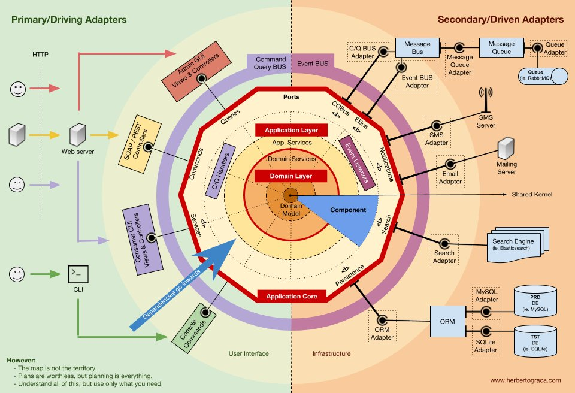
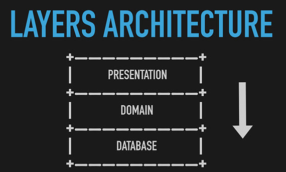
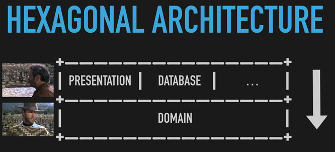

## Módulos
-   **Infraestructura:** son los elementos externos con los que se comunica la aplicación, tanto de entrada como de salida. Puntos de entrada son una API con REST o [GraphQL](https://graphql.org/), mensajería con [RabbitMQ](https://www.rabbitmq.com/) o mediante línea de comandos. Puntos de salida son una base de datos relacional con [PostgreSQL](https://www.postgresql.org/), no relacional con [MongoDB](https://www.mongodb.com/), o también envío de mensajes con RabbitMQ. A los puntos de entrada se les denomina puertos y a los puntos de salida adaptadores.
-   **Puertos:** una aplicación puede ofrecer diferentes formas de comunicación al mismo tiempo, ya sea con una API REST o GraphQL, mensajes o mediante línea de comandos.
-   **Adaptadores:** igualmente una aplicación puede utilizar diferentes bases de datos o sistemas de comunicación con el exterior.
-   **Aplicación:** son los *servicios* que definen la API pública del dominio e independiza al dominio de cualesquiera elementos de infraestructura actuales o en el futuro. ==La capa de aplicación es la interfaz que ofrece el dominio a sus consumidores==.
-   **Dominio:** contiene la lógica de negocio de la aplicación. Esta puede ser implementada usando los principios de DDD.

En las relaciones de los elementos ==algo ubicado en infraestructura puede hacer uso de elementos de aplicación, los elementos de aplicación de elementos de dominio pero desde dominio no se permite hacer uso de elementos de infraestructura ni de aplicación==, esto desacopla el dominio de los cambios que se produzcan en infraestructura, por ejemplo por añadir una base de datos diferente o añadir un nuevo puerto.

## Diferencia con Arquitectura en Capas

#### Arquitectura en Capas

- La arquitectura en capas tendría como centro la base de datos. Es decir, el dominio sería conocedor del sistema de persistencia y, por tanto, estaría acoplado a éste.

#### Arquitectura hexagonal (Puertos y Adaptadores)

- La base de datos se concibe como uno más de los puertos con los que nuestro dominio interactúa.

#### Inversión de dependencias
La forma que tienen los elementos de dominio de hacer uso de elementos de infraestructura es haciendo uso de la **inversión de dependencias**, es decir, en vez de que dominio tenga dependencias de infraestructura consiguiendo que infraestructura dependa de dominio.

## Entidades y Value Objects

#### Eventos de dominio
